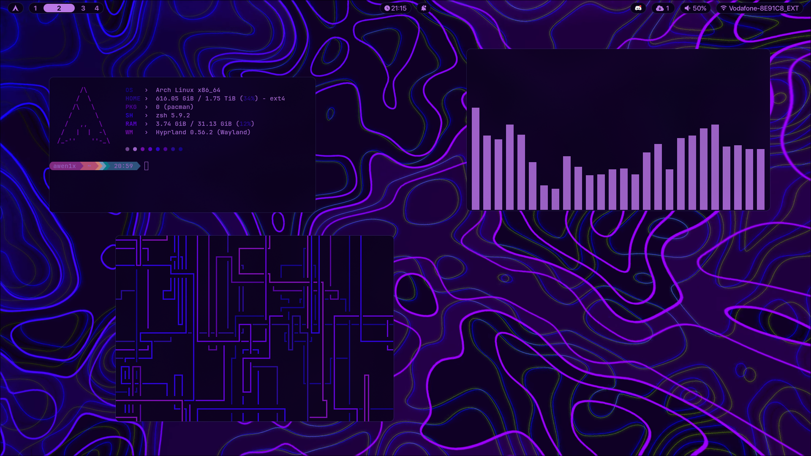
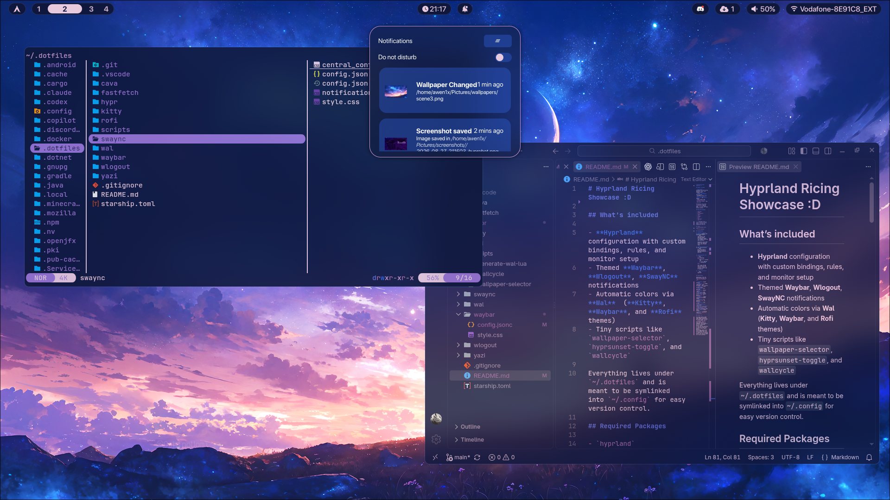
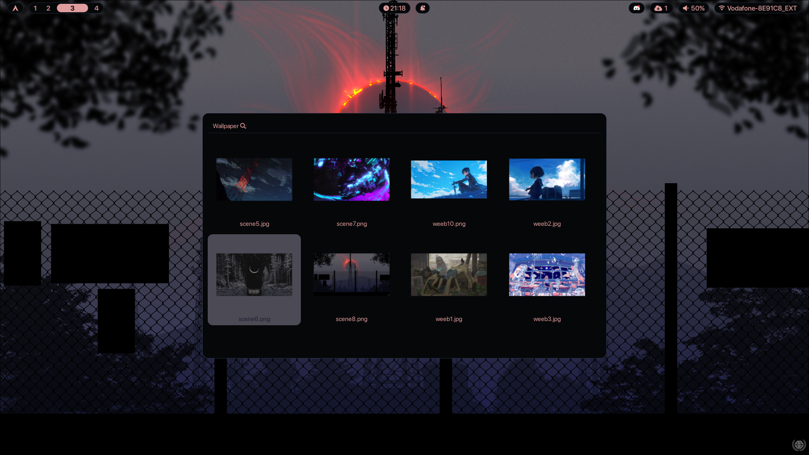
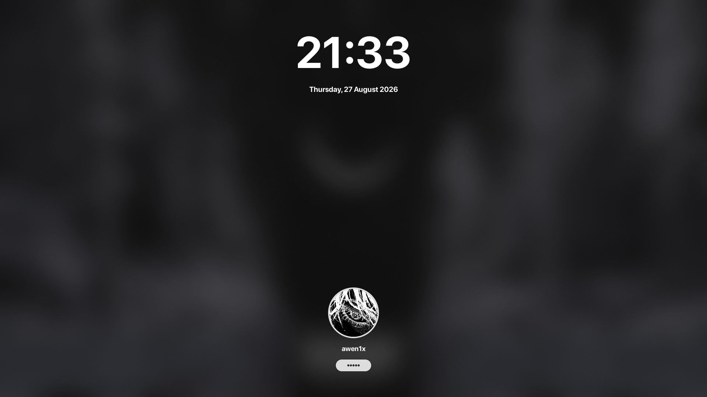

# awen1x's Hyprland Ricing Setup ✨





## What’s included

- **Hyprland** lua configuration with custom bindings, rules, and monitor setup
- Themed **Waybar**, **Wlogout**, **SwayNC** notifications
- Automatic colors via **Wal**  (**Kitty**, **Waybar**, and **Rofi** themes)
- Tiny scripts like `wallpaper-selector`, `hyprsunset-toggle`, and `wallcycle`

Everything lives under `~/.dotfiles` and is meant to be symlinked into `~/.config` for easy version control.

## Required Packages

- `hyprland`
- `waybar`
- `wl-clipboard`
- `swaync`
- `rofi`
- `wlogout`
- `kitty`
- `wal`
- `fastfetch`
- `cava` *

>  \* Packages that is used to flex the setup, doesn't provide any production value

## Fonts
- `JetBrainsMono Nerd Font` (icons)
- `SF Pro Display`

## Installation

1. **Install required packages** (example uses pacman/AUR helpers):
   ```bash
   sudo pacman -Syu hyprland waybar wl-clipboard swaync rofi wlogout kitty wal cava fastfetch
   ```
   optionally use an AUR helper for anything not in the official repos

2. **Clone the dotfiles** to your home directory:
   ```bash
   git clone https://github.com/awen1x/hyprland-setup.git ~/.dotfiles
   ```

3. **Link configs into `~/.config`**:
   ```bash
   cd ~/.dotfiles
   for d in *; do
       mkdir -p ~/.config/"$d"
       ln -sfn "$PWD/$d" ~/.config/"$d"
   done
   ```
   This loops through each subfolder and creates a symlink so you don't have to do it manually.

4. **Start Hyprland**:
   ```bash
   hyprland
   ```

## Keybindings

Keybindings! Toss the mice out and check out `hypr/module/binds.lua`.

- **SUPER+Q**: launch terminal.
- **SUPER+W** / ** SUPER+SHIFT+W**: cycle wallpaper / open selector.
- **SUPER+C**: close focused window.
- **SUPER+M**: exit Hyprland.
- **SUPER+B**: Waybar toggler.
- **SUPER+N**: open SwayNC control panel.
- **SUPER+E**: launch editor (`yazi` in terminal).
- **SUPER+F**: toggle floating for focused window.
- **SUPER+R**: run launcher (`rofi` by default).
- **SUPER+L**: lock screen;
- **SUPER+SHIFT+L**: logout menu.
- **SUPER + arrow keys**: change focus direction.
- **SUPER+[0-9] / 0**: switch to workspace 1–10 (with **SHIFT** moves window).
- **Print**: screenshot region to `~/Pictures/screenshots/`.

## Enjoy! ❤️

You might need to make some changes depending what device you're using. If using laptop, go to ``hypr/monitors.conf`` and remove `HDMI-A-1` since the monitor is embedded. Also change if you use a different monitor cable.
If you have any questions or help just shoot me a Discord friend request @awen1x

The changes should take effect immediately via the symlinks. This setup is meant to be a starting point; feel free to adapt it to your workflow!